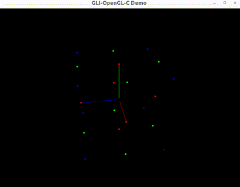
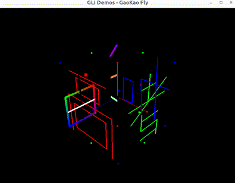

# GLI - GL Interface | WIP

gli是一个迷你的图形库抽象层接口

## 特性

- 接口简单
- 跨平台
- 支持语言
  - C/C++
  - Python

## 演示Demo

<table>
  <tr>
    <td align="center"><b>Examples</b></a>
    <td align="center"><b>Demos</b></a>
  </tr>
  <tr>
    <td align="center"><a href="https://github.com/Sunrisepeak/gl-interface/blob/main/examples/opengl/main.c"> <b>GLI空间坐标系</b></a>
    <td align="center"><a href="https://github.com/Sunrisepeak/gl-interface/blob/main/demos/gaokao-fly.cpp"> <b>高考起飞</b></a>
  </tr>
</table>